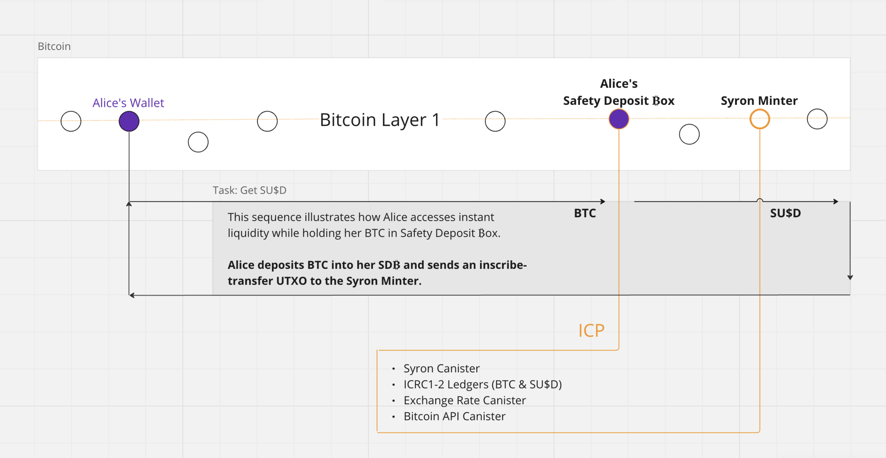

= Basic Bitcoin with Syron USD

== Overview

This Proof of Concept (PoC) is a work in progress to walk you through deploying Syron and withdrawing BRC-20 dollars (SYRON) on Bitcoin. Thus, Syron is a Bitcoin-native stablecoin based on the Ordinals protocol that smoothly integrates with the Internet Computer at the protocol level to offer access to USD liquidity and Decentralized Finance (DeFi) on Bitcoin Layer 1. Leveraging the https://internetcomputer.org/docs/current/references/samples/rust/basic_bitcoin/[Basic Bitcoin] foundation for the PoC, Syron ensures a smooth transition for this implementation.

Explore the https://docs.tyrondao.org[documentation] for more comprehensive insights.

== Architecture

The architecture of Syron includes:

- **Syron USD (SYRON)**: A stablecoin pegged to USD, minted by over-collateralizing Bitcoin in safety deposit boxes.
- **Safety Deposit ₿ox**: Hold BTC collateral and manage Syron operations.
- **Internet Computer Protocol (ICP)**: Facilitates smart contract execution and interoperability. The Internet Computer provides the foundation in terms of open-source software and reusable components, such as ckBTC and the Exchange Rate Canister.
- **Integration with Bitcoin**: Utilizes ICP for seamless integration with the Bitcoin network, enabling verification of BTC collateral and transaction management using chain-key cryptography.

This architecture ensures easy access to USD liquidity while retaining BTC ownership, fostering a permissionless system with enhanced security and interoperability within the Bitcoin DeFi ecosystem.

== Bitcoin Mainnet

Explore Tyron's open-source web application to interact with the Bitcoin mainnet:

https://tyron.io[tyron.io]

== Prerequisites

Commands are provided using macOS as an example.

* [x] Install the https://internetcomputer.org/docs/current/developer-docs/setup/install/index.mdx[Internet Computer SDK]

----
sh -ci "$(curl -fsSL https://internetcomputer.org/install.sh)"
----

To verify the installation, run:

----
dfx -V
----

=== Exchange Rate Canister

We are using the official XRC canister with ID "uf6dk-hyaaa-aaaaq-qaaaq-cai".

In case you want to deploy your own XRC canister, follow these steps:

Install dependencies:

----
cd src/xrc_demo && npm i
----

Deploy your own XRC canister:

----
dfx deploy
----
