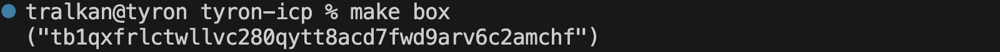

= Basic Bitcoin with Syron 

== Overview

This Proof of Concept (PoC) is a work in progress. Once completed, it'll walk you through deploying Tyron's stablecoin metaprotocol to withdraw Syron U$ dollars (SU$D) on Bitcoin. Syron is a Bitcoin-native stablecoin based on the Ordinals protocol that smoothly integrates with the Internet Computer at the protocol level to offer access to USD liquidity and Decentralized Finance (DeFi) on Bitcoin Layer 1. Leveraging the https://internetcomputer.org/docs/current/references/samples/rust/basic_bitcoin/[Basic Bitcoin] foundation for the PoC, Syron ensures a smooth transition for this implementation.

Explore the https://docs.tyron.io[documentation] for more comprehensive insights.

== Architecture

image::public/images/syron_minting.png[]

The architecture of Syron includes:

- **Syron U$ Dollar (SU$D)**: A stablecoin pegged to USD, minted by over-collateralizing Bitcoin in safety deposit boxes.
- **Safety Deposit ₿ox**: Hold BTC collateral and manage SU$D operations.
- **Internet Computer Protocol (ICP)**: Facilitates smart contract execution and interoperability. The Internet Computer provides the foundation in terms of open-source software and reusable components, such as ckBTC and the Exchange Rate Canister.
- **Integration with Bitcoin**: Utilizes ICP for seamless integration with the Bitcoin network, enabling verification of BTC collateral and transaction management using chain-key cryptography.

This architecture ensures easy access to USD liquidity while retaining BTC ownership, fostering a permissionless system with enhanced security and interoperability within the Bitcoin DeFi ecosystem.

== Bitcoin Testnet

Explore Tyron's open-source web application to interact with the Bitcoin testnet:

https://testnet.tyron.io[testnet.tyron.io]

== Prerequisites

Commands are provided using macOS as an example.

* [x] Install the https://internetcomputer.org/docs/current/developer-docs/setup/install/index.mdx[Internet Computer SDK]

----
sh -ci "$(curl -fsSL https://internetcomputer.org/install.sh)"
----

To verify the installation, run:

----
dfx -V
----

== Local Deployment

* [x] Download https://bitcoin.org/en/download[Bitcoin Core]

After downloading, unpack the .tar.gz file:

----
tar -xfz bitcoin-25.0-x86_64-apple-darwin.tar.gz
----

Then, open the bitcoin.conf file and insert the following content:

----
# Enable regtest mode. This is required to setup a private bitcoin network.
regtest=1

# Dummy credentials that are required by `bitcoin-cli`.
rpcuser=ic-btc-integration
rpcpassword=QPQiNaph19FqUsCrBRN0FII7lyM26B51fAMeBQzCb-E=
rpcauth=ic-btc-integration:cdf2741387f3a12438f69092f0fdad8e$62081498c98bee09a0dce2b30671123fa561932992ce377585e8e08bb0c11dfa
----

And start a local Bitcoin runtime with the command:

----
./bin/bitcoind -conf=$(pwd)/bitcoin.conf -datadir=$(pwd)/data --port=18444
----

=== Execution Environment

Start a local Internet Computer execution environment:

----
dfx start --clean
----

In a separate terminal tab, update the submodules recursively:

----
git submodule update --init --recursive
----

Let's use the ICP local network:

----
export NET=local
----

=== Syron Ledgers

Deploy the BTC & SU$D ledgers:

----
make ledgers
----

Save their IDs:

----
export BTC_LEDGER=$(dfx canister id icrc1_ledger_syron_btc) SUSD_LEDGER=$(dfx canister id icrc1_ledger_syron_susd)
----

=== Exchange Rate Canister

Install dependencies:

----
cd src/xrc_demo && npm i
----

Deploy locally:

----
dfx deploy
----

=== Syron Minter

Finally, deploy the Syron minter using:

----
cd ../.. && make deploy
----

=== Safety Deposit ₿ox

1) Save your BTC testnet address:

----
export SSI=<your_btc_address>
----

2) Obtain the address of your SD₿ with the following command:

----
make box
----

3) Deposit BTC into your Safety Deposit ₿ox

You can mine blocks to earn bitcoin. Go to your Bitcoin Core repo and run the following command to mine 1 block:

----
./bin/bitcoin-cli -conf=$(pwd)/bitcoin.conf generatetoaddress 1 <your_box_address>
----

