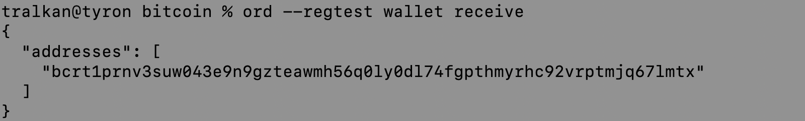

= Basic Bitcoin with Syron 

== Overview

This Proof of Concept (PoC) is a work in progress. Once completed, it'll walk you through deploying Tyron's stablecoin metaprotocol to withdraw Syron U$ dollars (SU$D) on Bitcoin. Syron is a Bitcoin-native stablecoin based on the Ordinals protocol that smoothly integrates with the Internet Computer at the protocol level to offer access to USD liquidity and Decentralized Finance (DeFi) on Bitcoin Layer 1. Leveraging the https://internetcomputer.org/docs/current/references/samples/rust/basic_bitcoin/[Basic Bitcoin] foundation for the PoC, Syron ensures a smooth transition for this implementation.

Explore the https://docs.tyron.io[documentation] for more comprehensive insights.

== Architecture

image::public/images/syron_minting.png[]

The architecture of Syron includes:

- **Syron U$ Dollar (SU$D)**: A stablecoin pegged to USD, minted by over-collateralizing Bitcoin in safety deposit boxes.
- **Safety Deposit ₿ox**: Hold BTC collateral and manage SU$D operations.
- **Internet Computer Protocol (ICP)**: Facilitates smart contract execution and interoperability. The Internet Computer provides the foundation in terms of open-source software and reusable components, such as ckBTC and the Exchange Rate Canister.
- **Integration with Bitcoin**: Utilizes ICP for seamless integration with the Bitcoin network, enabling verification of BTC collateral and transaction management using chain-key cryptography.

This architecture ensures easy access to USD liquidity while retaining BTC ownership, fostering a permissionless system with enhanced security and interoperability within the Bitcoin DeFi ecosystem.

== Bitcoin Testnet

Explore Tyron's open-source web application to interact with the Bitcoin Testnet:

https://tyron.io[tyron.io]

== Prerequisites

Commands are provided using macOS as an example.

* [x] Install the https://internetcomputer.org/docs/current/developer-docs/setup/install/index.mdx[Internet Computer SDK]

----
sh -ci "$(curl -fsSL https://internetcomputer.org/install.sh)"
----

To verify the installation, run:

----
dfx -V
----

== Bitcoin and Ord Local Deployment on Regtest

* [x] Download https://bitcoin.org/en/download[Bitcoin Core]

After downloading, unpack the .tar.gz file:

----
tar -xzf bitcoin-25.0-x86_64-apple-darwin.tar.gz
----

Open the .zshrc & save your path to bitcoind:

----
nano ~/.zshrc 
export PATH="/Users/tralkan/bitcoin/bitcoin-25.0/bin:$PATH"
----

Download  `ord`:

----
brew install ord
----

Run Regtest:

----
bitcoind -regtest -txindex
----

----
bitcoin-cli -regtest -getinfo
----

----
ord --regtest server
----

Create a new wallet and get its address:

----
ord --regtest wallet create
ord --regtest wallet receive
----

1- Save the address of your Bitcoin wallet, e.g.:

----
export SSI=<your_wallet_address>
----

Mine some bitcoin into your wallet:

----
bitcoin-cli -regtest generatetoaddress 3 <your_wallet_address>
----

And check your wallet balance:

----
ord --regtest wallet balance 
----

=== Internet Computer Execution Environment

Start a local Internet Computer execution environment:

----
dfx start --clean
----

In a separate terminal tab, update the submodules recursively:

----
git submodule update --init --recursive
----

2- Select the ICP local network:

----
export NET=local
----

=== Syron Ledgers

3- Get your principal's ID:

----
export SYRON=$(dfx identity get-principal)
export PRINCIPAL=$(dfx identity get-principal)
----

Deploy the BTC & SU$D ledgers:

----
make ledgers
----

4- Save the Syron ledgers IDs:

----
export BTC_LEDGER=$(dfx canister id icrc1_ledger_syron_btc) SUSD_LEDGER=$(dfx canister id icrc1_ledger_syron_susd)
----

=== Exchange Rate Canister

We are using the official XRC canister with ID "uf6dk-hyaaa-aaaaq-qaaaq-cai".

In case you want to deploy your own XRC canister, follow these steps:

Install dependencies:

----
cd src/xrc_demo && npm i
----

Deploy your own XRC canister:

----
dfx deploy
----

=== Syron Minter

5- Set the ECDSA key name (test_key_1 on Testnet or dfx_test_key on Regtest):

----
export ECDSA_KEY=dfx_test_key
----

*Deploy the Syron minter*:

----
make syron
----

6- Save Syron's ID:

----
export SYRON=$(dfx canister id basic_bitcoin_tyron)
----

Reinstall the Syron ledgers, which sets Syron's ID as the minting account:

----
make re_ledgers
----

=== Safety Deposit ₿ox

Obtain the address of your SD₿ with the following command:

----
make box
----

image::public/images/syron_make_box.png[]

3) Deposit BTC into your Safety Deposit ₿ox

You can mine blocks to earn bitcoin. Go to your Bitcoin folder and run the following command:

----
bitcoin-cli -regtest generatetoaddress 3 <your_box_address>
----

== Withdraw SU$D

----
make susd
----
